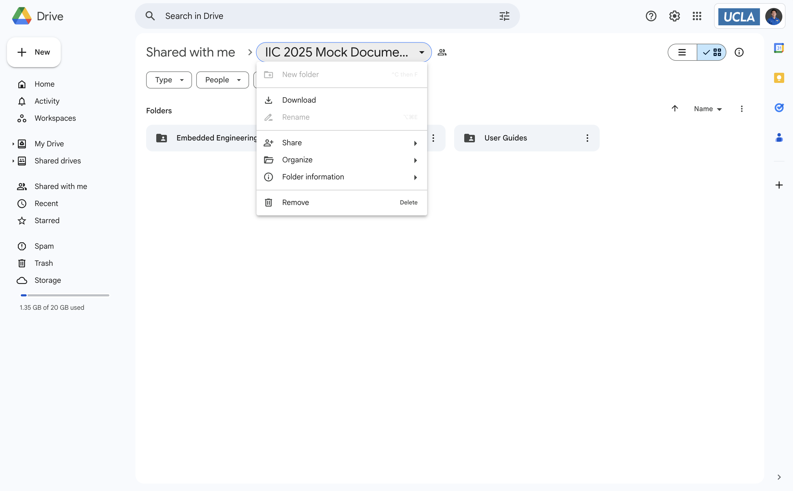
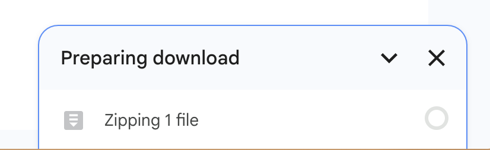

# Google Drive to Confluence Migration Automation

This project contains scripts to help you automate the process of cleaning up and uploading Word documents (`.docx` files) to Atlassian Confluence, preserving folder structure and creating a navigable hierarchy of pages.

# Demo

https://github.com/user-attachments/assets/4e21d5a1-1ff8-423e-b0d7-a03ee7530362

*If the video above doesn't play, you can [download the demo video directly](DemoVideo.mp4)*

# Setup

## Step 1: Download from Google Drive

First, you need to download the folder from Google Drive:

1. Navigate to your Google Drive folder containing the documents
2. Right-click on the folder and select "Download" 
   
3. Wait for Google Drive to prepare and download your files as a ZIP archive
   

## Step 2: Prepare the Local Data Directory

1. Create a `data` directory in the root of this project if it doesn't exist already
   ```bash
   mkdir -p data
   ```

2. Move the downloaded ZIP file to the project's root directory

3. Extract the contents of the ZIP file into the data directory:
   ```bash
   unzip downloaded-folder.zip -d data/
   ```
   
4. Clean up by removing the ZIP file:
   ```bash
   rm downloaded-folder.zip
   ```

Your directory structure should now look like this:

```
/project-root
├── README.md
├── upload_to_confluence.py
├── delete_non_docx.py
├── .env.sample
├── .env (your configuration file)
└── data/
    ├── base_folder/
        ├── document1.docx
        ├── document2.docx
        └── any_additional_subfolder/
            ├── document3.docx
            └── document4.docx
```

## Scripts Overview

The project consists of two main scripts:

1. **`delete_non_docx.py`** - Cleans up your data directory by removing all non-`.docx` files
2. **`upload_to_confluence.py`** - Uploads all `.docx` files to Confluence as native pages with proper hierarchy

## Requirements

- Python 3.6+
- Required Python packages:
  - `requests`
  - `python-docx`
  - `beautifulsoup4`
  - `python-dotenv`
  - `lxml`
  - `html5lib`

## Installation

1. Clone this repository or download the script files
2. Install required packages:
   ```bash
   pip3 install requests python-docx beautifulsoup4 python-dotenv lxml html5lib
   ```

## Script 1: Delete Non-DOCX Files

This script helps you clean up your `data` directory by removing all files that are not Word documents (`.docx`).

### How to Run

```bash
python3 delete_non_docx.py
```

### Features

- Recursively scans through the `data` directory and its subdirectories
- Identifies and lists all non-`.docx` files
- Requires confirmation before deleting anything
- Reports how many files were successfully deleted

### Safety Features

- **Preview**: Shows you exactly which files will be deleted before taking action
- **Confirmation Required**: Nothing is deleted without your explicit confirmation
- **Detailed Reporting**: Reports which files were deleted and which failed (if any)

## Script 2: Upload DOCX Files to Confluence

This script uploads all `.docx` files from your `data` directory to Atlassian Confluence, preserving the folder structure as a hierarchy of pages.

### Configuration

1. Create a `.env` file based on the provided `.env.sample`:
   ```
   CONFLUENCE_BASE_URL=https://your-domain.atlassian.net
   API_TOKEN=your-api-token
   USERNAME=your-email@example.com
   SPACE_KEY=SPACEKEY
   ROOT_PAGE_ID=123456  # Optional
   ```

2. To get an Atlassian API token:
   - Go to [https://id.atlassian.com/manage-profile/security/api-tokens](https://id.atlassian.com/manage-profile/security/api-tokens)
   - Click "Create API token"
   - Give your token a name (e.g., "Docx Upload Script")
   - Copy the token value

3. To find your Space Key:
   - Navigate to the space in your Confluence instance
   - Look at the URL, which may contain the space key (e.g., `/spaces/SPACEKEY/...`)
   - Alternatively, go to Space Settings > Overview to see the key

4. To find a Page ID (optional, for root page):
   - Navigate to the page in your browser
   - Look at the URL, which may contain the page ID in a format like `pageId=123456`

### How to Run

```bash
python3 upload_to_confluence.py
```

### Features

- **Folder Structure Preservation**: Creates a matching folder hierarchy in Confluence
- **DOCX to Native Pages**: Converts `.docx` content to HTML and displays it in Confluence pages
- **Attachment Upload**: Uploads original `.docx` files as attachments for reference
- **Permission Control**: Dynamically sets page permissions based on filename suffixes:
  - `[INT]` - Internal access (organization members only) - this is the default
  - `[PUB]` - Organization members only access (same as `[INT]`)
  - `[RES]` - Restricted access (owner only)
  - Example: `Software Development Mock Doc 1 [INT].docx`
- **Folder Navigation**: Creates folder pages with separate sections for:
  - "This folder contains the following folders:" - Links to immediate subfolders
  - "This folder contains the following pages:" - Links to immediate document pages
- **Update Existing Content**: Updates pages if they already exist rather than creating duplicates
- **Progress Reporting**: Shows detailed progress as the upload proceeds

### Process Steps

The upload script works in three steps:
1. **Step 1**: Creates folder structure in Confluence
2. **Step 2**: Uploads `.docx` files as pages with attachments
3. **Step 3**: Updates folder pages with links to their children

## Notes

- The script directory should be the parent of your `data` directory
- The upload script uses Confluence REST API v2 for page operations and v1 for attachment uploads
- No files are deleted from Confluence; the script only adds or updates content
